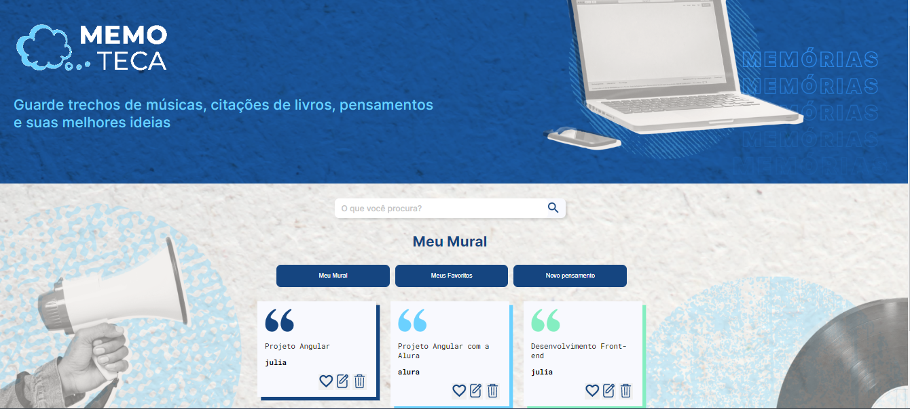

# Projeto Memoteca
Projeto desenvolvido durante dois cursos de Angular 14 da Alura, sendo esses cursos: 

- Angular 14: aplique os conceitos e desenvolva seu primeiro CRUD
- Angular 14: evoluindo a aplicação

Durante o primeiro curso desenvolvemos uma aplicação do começo ao fim, utilizando o CRUD para definir as suas funcionalidade. A Memoteca é um Single Page Aplication cujo objetivo é armazenar pensamentos que o usuário adiciona, nela é possível inserir, editar e excluir os pensamentos. No segundo curso foi feita algumas melhorias e ajustes onde foram encontradas algumas necessidades, como o campo de busca, favoritar um pensamento e filtrar.

## As tecnologias utilizadas para o desenvolvimento foram:
• HTML 
• CSS 
• TypeScript 
• Angular 
• Json Server 

## Foto da aplicação 

